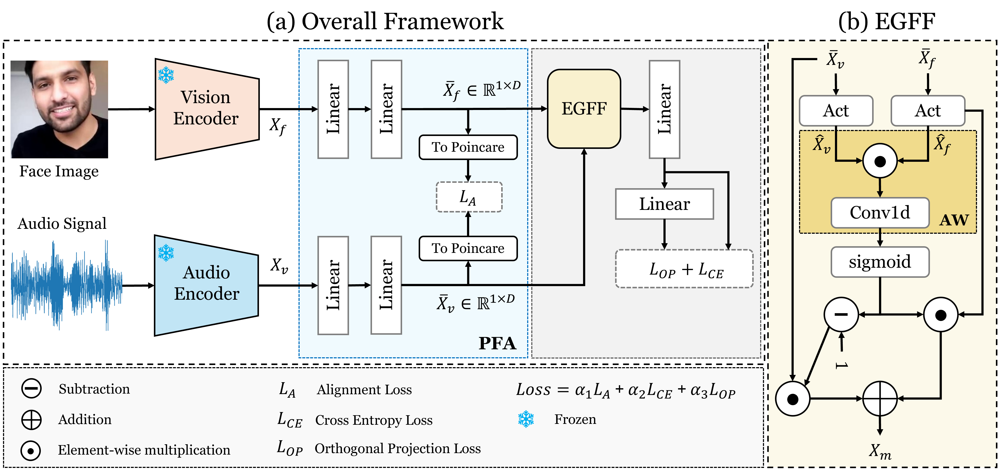

# Precise Alignment and Enhanced Gated Feature Fusion for Face-Voice Association (InterSpeech 2025)

Paper link: [arxiv](https://arxiv.org/abs/2505.17002) &nbsp; [ISCA](https://www.isca-archive.org/interspeech_2025/hannan25_interspeech.html)

### Latest News
- Code is released !!!


## Overview
The fusion of feature representations that come from different embedding spaces is ineffective unless the two embedding spaces are aligned, and it limits the ability of loss formulation to maximize the distance between the inter-identity representations.

PAEFF is a dual branch face-voice association framework that enables the model to align the embeddings of faces and voices in hyperbolic space by preserving the distances and complex relationships before fusing them.

## Architecture


### Installation
Please follow the instructions [here](https://github.com/msaadsaeed/FOP) to make the environment and install the libraries.
You can also find the csv files of extracted features [here](https://github.com/msaadsaeed/FOP)

## Training
You can utilize following command to train the model.
```
python main.py --save_dir ./model --lr 2e-5 --batch_size 1024 --max_num_epoch 50 --dim_embed 256 \
--train_path_face <path_to_train_face_features> \
--train_path_voice <path_to_train_voice_features> \
--test_path_face <path_to_test_face_features> \
--test_path_voice <path_to_test_voice_features>
```

## Testing
Set your features file path test.py and use following command to evaluate your trained model
```
python test.py --ckpt <path to checkpoint.pth.tar> --dim_embed 256 
```

Model weights will be released soon !!!


## Acknowledgements
The codebase is inspired from the [FOP](https://github.com/msaadsaeed/FOP) repository. We thank them for releasing their valuable codebase. 

## Citation
```
@inproceedings{hannan25_interspeech,
  title     = {{PAEFF: Precise Alignment and Enhanced Gated Feature Fusion for Face-Voice Association}},
  author    = {Abdul Hannan and Muhammad Arslan Manzoor and Shah Nawaz and Muhammad Irzam Liaqat and Markus Schedl and Mubashir Noman},
  year      = {2025},
  booktitle = {{Interspeech 2025}},
  pages     = {2710--2714},
  doi       = {10.21437/Interspeech.2025-268},
  issn      = {2958-1796},
}

@misc{paeff2025,
      title={PAEFF: Precise Alignment and Enhanced Gated Feature Fusion for Face-Voice Association}, 
      author={Abdul Hannan and Muhammad Arslan Manzoor and Shah Nawaz and Muhammad Irzam Liaqat and Markus Schedl and Mubashir Noman},
      year={2025},
      eprint={2505.17002},
      archivePrefix={arXiv},
      primaryClass={cs.CV},
      url={https://arxiv.org/abs/2505.17002}, 
}
```
